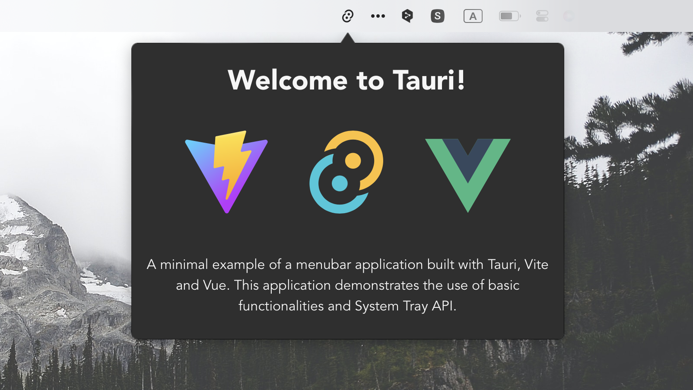

# Tauri Menubar

<p align="center">
  
</p>

A minimal example of a menubar application built with [Tauri](https://tauri.app/). This application demonstrates the use of basic functionalities and System Tray API.

To learn more about how this application was built, check out the article [Creating a Menubar Application with Tauri](https://medium.com/@4gray/create-menubar-app-with-tauri-510ab7f7c43d).

## Features

- Toggle window when clicking on an icon in menubar/tray
- Positioning the window centrally below the icon
- Hiding dock icon for macOS and windows
- Click outside to hide the application
- Right click context menu
- CSS based arrow between menubar and application

## Running the application

To run the application, you need to have Tauri installed on your machine. You can find the installation instructions on the Tauri website.

    $ pnpm install 
    $ pnpm tauri dev

## Build the Mac app

```bash
$ pnpm tauri build --bundles app  
```

## License

This project is licensed under the MIT License - see the LICENSE file for details

## Acknowledgements

Tauri Team for providing the framework
